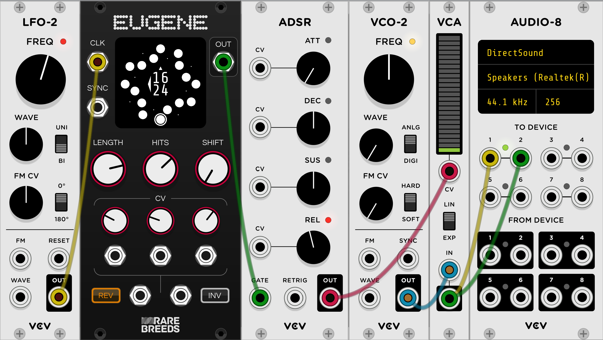

# Orbits Manual

Orbits is an [open source](https://github.com/RareBreeds/Orbits/) plugin for [VCV Rack](https://vcvrack.com/).

## Eugene

Eugene is a [Euclidean Rhythm](https://en.wikipedia.org/wiki/Euclidean_rhythm) generator module.

### Example Patch

### Specifications
 * [Euclidean Rhythms](https://en.wikipedia.org/wiki/Euclidean_rhythm) up to 32 beats long
 * Rhythms are both reversible and invertible
 * External clock input
 * Sync input for syncing the start of the rhythm with another signal
 * Shift knob for selecting the initial beat of the rhythm
 * Lots of CV controllable parameters

### Panel

### Out : Output
A pulse is output when an on-beat (hit) is clocked. 0-10V Unipolar CV 1ms pulse duration.

### Clk : Input
A rising edge advances the current beat. Schmitt triggered.

### Sync : Input
Resets the current beat to the first beat of the rhythm which is always 12 o'clock on the display. Schmitt triggered.

In versions after v1.1.0 the input is latched and applied on the next rising clock edge. This allows any high level at any time during the clock period to be used to reset the rhythm, for example the output of one Eugene can be fed into the sync input to start a rhythm again based on the on-beat in another rhythm.

In the first release (v1.1.0) this input was synchronous, the sync was only applied if a rising edge of Clk happened whilst this signal was high.

### Len : Input
The number of beats in the rhythm. Integer range between 1 to 32 inclusive.

### Hits : Input
The number of on-beats in the rhythm, or the density. Integer range between 0 and the current Length inclusive.

### Shift : Input
Sets the beat in the rhythm to start from. A sync pulse will set the current beat to this number of beats before beat 0. Integer range between 0 and the current Length - 1 inclusive.
Rotating this knob has the effect of rotating the beat the same direction around the circle.

### Reverse : Input
Sets the direction that the clock advances the beat. Clockwise when off, anticlockwise when on.

### Invert : Input
Inverts the Euclidean algorithm. When this switch is on on-beats become off-beats and off-beats become on-beats. Visually you can tell this is enabled by the on-beats being represented as empty circles rather than whole ones.

### CV : Input
All manually controlled inputs are also CV controllable.

Len, Hits and Shift have +-5V bipolar CV inputs with a knob for adjusting CV gain. The CV is summed with the current knob setting.

Reverse and Invert have Schmitt triggered CV inputs that override the switch settings.

